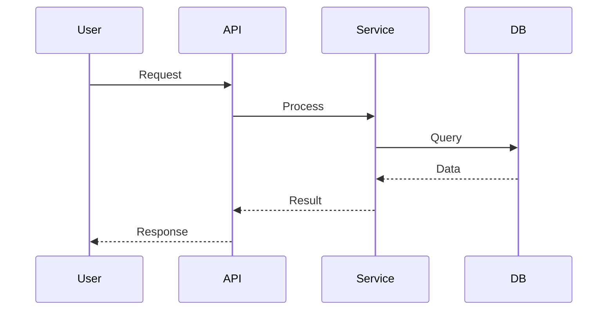

# Architecture Designer - 架构设计器

## 目标

将业务需求转化为技术架构设计，记录关键决策及其权衡。

## 架构设计流程

### Step 1: 需求分析

**输入**: PRD或需求文档

**分析要点**:
- 功能需求：系统需要做什么？
- 非功能需求：性能/安全/可用性/可扩展性
- 约束条件：技术栈/预算/时间/团队

### Step 2: 系统边界

**目的**: 明确系统范围和外部接口

```markdown
## 系统边界

### 核心系统
- {系统A}: {职责}
- {系统B}: {职责}

### 外部依赖
- {外部系统1}: {接口/协议}
- {外部系统2}: {接口/协议}

### 数据流
```
用户 → [API Gateway] → [Core Service] → [Database]
                              ↓
                         [External API]
```
```

### Step 3: 模块设计

**目的**: 系统分层和模块划分

```markdown
## 系统架构

### 分层架构
```
┌─────────────────────────────────┐
│     Presentation Layer          │  UI/API
├─────────────────────────────────┤
│      Business Logic Layer       │  业务逻辑
├─────────────────────────────────┤
│      Data Access Layer          │  数据访问
├─────────────────────────────────┤
│      Infrastructure Layer       │  基础设施
└─────────────────────────────────┘
```

### 模块划分
| 模块 | 职责 | 接口 | 依赖 |
|------|------|------|------|
| UserModule | 用户管理 | IUserService | Database |
| OrderModule | 订单处理 | IOrderService | UserModule, PaymentModule |
```

### Step 4: 数据流设计

**目的**: 描述数据如何在系统中流动

```markdown
## 数据流设计

### 核心流程

```

### Step 5: API设计

**目的**: 定义API接口

```markdown
## API设计

### RESTful API

#### POST /api/users
**描述**: 创建用户

**请求**:
```json
{
  "email": "user@example.com",
  "password": "hashed_password",
  "name": "User Name"
}
```

**响应**:
```json
{
  "id": "user_id",
  "email": "user@example.com",
  "name": "User Name",
  "createdAt": "2026-01-29T10:00:00Z"
}
```

**错误响应**:
```json
{
  "error": "INVALID_EMAIL",
  "message": "Email format is invalid"
}
```
```

### Step 6: 风险评估

```markdown
## 风险评估

| 风险 | 影响 | 概率 | 缓解措施 |
|------|------|------|---------|
| 数据库单点 | 高 | 中 | 主从复制 + 缓存 |
| API性能瓶颈 | 中 | 高 | 限流 + 缓存 + 异步 |
| 第三方依赖 | 中 | 中 | 降级 + 重试 |
```

## ADR (Architecture Decision Record)

### ADR模板

```markdown
# ADR-{编号}: {决策标题}

## 状态
{提议/已接受/已弃用/已替代}

## 上下文
{描述驱动这个决策的技术背景、问题或需求}

## 决策
{描述我们做出的决策}

## 原因和后果
### 正面后果
- {好处1}
- {好处2}

### 负面后果
- {代价1}
- {代价2}

### 风险
- {风险1}
- 缓解措施: {方案}

## 替代方案
### 方案A: {描述}
- 优点: {...}
- 缺点: {...}

### 方案B: {描述}
- 优点: {...}
- 缺点: {...}

## 相关决策
- ADR-{编号}: {相关决策}

## 相关文档
- [文档链接]({url})
```

### ADR示例

```markdown
# ADR-001: 采用PostgreSQL作为主数据库

## 状态
已接受

## 上下文
我们需要一个可靠的关系型数据库来存储核心业务数据。主要考虑：
- 数据一致性要求高
- 事务支持必需
- 复杂查询需求

## 决策
采用PostgreSQL作为主数据库。

## 原因和后果
### 正面后果
- ACID事务保证数据一致性
- 丰富的数据类型（JSON/数组等）
- 成熟的查询优化器
- 强大的生态工具

### 负面后果
- 相比NoSQL扩展性受限
- 需要额外的分片方案应对大数据量

### 风险
- 单点故障风险
- 缓解措施：主从复制 + 自动故障转移

## 替代方案
### MySQL
- 优点：更广泛的云服务支持
- 缺点：JSON支持较弱

### MongoDB
- 优点：Schema灵活，扩展性好
- 缺点：事务支持较弱

## 相关决策
- ADR-002: Redis缓存策略

## 相关文档
- [PostgreSQL官方文档](https://www.postgresql.org/docs/)
```

## 架构文档生成

### 完整架构文档模板

```markdown
# {系统名称} 架构设计文档

## 1. 概述

### 1.1 系统目标
{系统要达成的目标}

### 1.2 范围
- 包含：{功能范围}
- 不包含：{明确排除}

### 1.3 约束
- 技术栈：{技术选型}
- 非功能需求：{性能/安全/可用性}

## 2. 架构视图

### 2.1 系统边界
{系统边界图}

### 2.2 分层架构
{架构分层图}

### 2.3 模块划分
{模块说明}

## 3. 数据架构

### 3.1 数据模型
{ER图或数据模型描述}

### 3.2 数据流
{数据流图}

### 3.3 存储策略
{存储方案}

## 4. 接口设计

### 4.1 API规范
{API设计规范}

### 4.2 核心API
{API列表}

### 4.3 第三方集成
{外部接口}

## 5. 技术选型

| 组件 | 技术 | 理由 |
|------|------|------|
| Web框架 | {技术} | {理由} |
| 数据库 | {技术} | {理由} |
| 缓存 | {技术} | {理由} |

## 6. 非功能设计

### 6.1 性能
- 响应时间: {指标}
- 吞吐量: {指标}

### 6.2 安全
- 认证: {方案}
- 授权: {方案}

### 6.3 可用性
- 高可用: {方案}
- 容灾: {方案}

## 7. 部署架构

{部署架构图}

## 8. ADR索引

- ADR-001: {决策1}
- ADR-002: {决策2}
```

## 与其他技能的集成

### 前置技能
- `requirements-clarifier` - 需求澄清后进行架构设计
- `prd-generator` - PRD完成后进入架构设计

### 后置技能
- `tech-proposal` - 架构设计后进行技术方案评估
- `implementation-plan-writer` - 实施计划

### 协作技能
- `ui-ux-design-system-generator` - 前端架构设计
- `supabase-postgres-best-practices` - 数据库架构优化

## 架构评审检查清单

```markdown
## 架构评审清单

### 完整性
- [ ] 系统边界明确
- [ ] 模块职责清晰
- [ ] 数据流完整
- [ ] 接口定义完整

### 可行性
- [ ] 技术选型合理
- [ ] 风险识别充分
- [ ] 缓解措施有效

### 可扩展性
- [ ] 支持水平扩展
- [ ] 模块解耦
- [ ] 接口版本管理

### 可维护性
- [ ] 文档完整
- [ ] ADR记录完整
- [ ] 代码结构清晰
```

---

**维护**: 根据架构设计经验持续优化
**来源**: Cursor Hi Offer architecture-designer
**相关**: tech-proposal, implementation-plan-writer, requirements-clarifier
