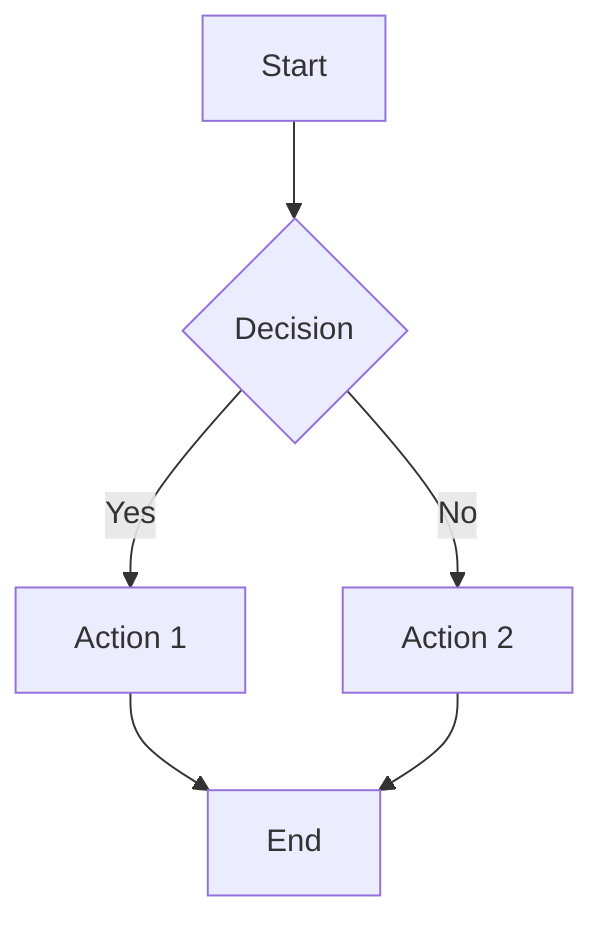

# Obsidian Skills

Agent skills for Obsidian that enable creating and editing Obsidian-compatible files within Claude Code.

## Supported File Types

### 1. Obsidian Flavored Markdown (.md)
Extended markdown with Obsidian-specific features:
- **Wiki Links**: `[[Internal Link]]`
- **Embeds**: `![[Embedded Note]]`
- **Tags**: `#tag`
- **Frontmatter**: YAML metadata
- **Callouts**: Admonition blocks
- **Math**: LaTeX expressions
- **Diagrams**: Mermaid syntax

### 2. Obsidian Bases (.base)
Database-like tables with:
- Rich text fields
- Tags
- Filters
- Sorting
- Relations

### 3. JSON Canvas (.canvas)
Visual canvas with:
- Nodes (text, files, web)
- Connections
- Grouping
- Spatial organization

## Installation

Skills are installed in `~/.claude/skills/obsidian-skills/`

## Usage Patterns

### Creating Notes
```markdown
<!-- Create a new note with wiki links -->
# Topic Name

Related: [[Related Topic]]
Tags: #tag1 #tag2

## Content
Your note content here.
```

### Creating Callouts
```markdown
> [!INFO] Information
> This is an info callout

> [!WARNING] Warning
> This is a warning callout

> [!TIP] Tip
> This is a helpful tip
```

### Creating Diagrams
```markdown

```

### Frontmatter
```markdown
---
type: note
tags: [tag1, tag2]
created: 2024-01-01
updated: 2024-01-02
---

# Note Title
```

## Common Workflows

### Knowledge Base Structure
```
vault/
├── 00-Inbox/
│   └── Quick capture notes
├── 01-Projects/
│   ├── Project A/
│   └── Project B/
├── 02-Areas/
│   ├── Health/
│   └── Finance/
├── 03-Resources/
│   ├── Reference/
│   └── Templates/
└── 04-Archives/
    └── Completed items
```

### Daily Notes
```markdown
# 2024-01-01

## Tasks
- [ ] Task 1
- [ ] Task 2

## Notes
- Note 1
- Note 2

## Journal
Entry for today...
```

### Zettelkasten / Notes
```markdown
---
type: zettel
tags: [concept, reference]
---

# Concept Title

## Core Idea
The main concept...

## Related
- [[Related Concept 1]]
- [[Related Concept 2]]

## Examples
Real-world examples...

## Sources
Reference to source material...
```

## Templates

### Meeting Notes
```markdown
# Meeting: [Title]

**Date:** {{date}}
**Attendees:**
**Type:** #meeting

## Agenda
1. Item 1
2. Item 2

## Discussion
- Point 1
- Point 2

## Action Items
- [ ] [ ] Action 1 - @Owner
- [ ] Action 2 - @Owner

## Next Meeting
Date and time...
```

### Project Notes
```markdown
# Project: [Name]

**Status:** Active | On Hold | Completed
**Start Date:**
**Target Date:**

## Goals
- Goal 1
- Goal 2

## Tasks
- [ ] Task 1
- [ ] Task 2

## Resources
- [[Resource 1]]
- [[Resource 2]]

## Notes
Project notes...

## Timeline
### Week 1
- Completed tasks

### Week 2
- Planned tasks
```

### Book Notes
```markdown
# Book Title

**Author:**
**Rating:** ⭐⭐⭐⭐⭐
**Finished:**
**Tags:** #book #reading

## Summary
Brief summary...

## Key Insights
1. Insight 1
2. Insight 2

## Highlights
- Quote 1
- Quote 2

## Action Items
- [ ] Action inspired by book
- [ ] Another action

## Related
- [[Related Topic]]
- [[Another Topic]]
```

## Best Practices

1. **Consistent Structure**: Use templates for consistency
2. **Meaningful Links**: Link related concepts
3. **Tag Strategy**: Develop consistent tag taxonomy
4. **Regular Reviews**: Periodically review and organize
5. **Capture Quickly**: Use inbox for quick capture
6. **Process Regularly**: Move from inbox to proper locations

## Integration with Other Skills

- **planning-with-files**: For project planning in Obsidian
- **dev-workflow**: For documentation alongside development
- **frontend-design**: For design documentation
- Any skill that benefits from knowledge management

## Quick Reference

| Feature | Syntax | Purpose |
|---------|--------|---------|
| Wiki Link | `[[Link]]` | Internal linking |
| Embed | `![[Embed]]` | Embed content |
| Tag | `#tag` | Categorization |
| Frontmatter | `---` | Metadata |
| Callout | `> [!TYPE]` | Highlighted blocks |
| Math | `$` or `$$` | Equations |
| Code | ` ``` ` | Code blocks |
| Mermaid | ` ```mermaid ` | Diagrams |

## Advanced Features

### Dataview Queries
```markdown
```dataview
LIST
FROM "Projects"
WHERE status = "Active"
SORT file.name ASC
```
```

### Templates Plugin
```markdown
<% tp.date.now("YYYY-MM-DD") %>
<% tp.file.title %>
```

### QuickAdd
Create quick capture workflows for common note types.

## Tips

1. **Start Simple**: Basic markdown first, add features gradually
2. **Use Properties**: YAML frontmatter for metadata
3. **Link Liberally**: More connections = better knowledge graph
4. **Review Regularly**: Weekly reviews keep system organized
5. **Customize**: Make Obsidian work for your workflow
