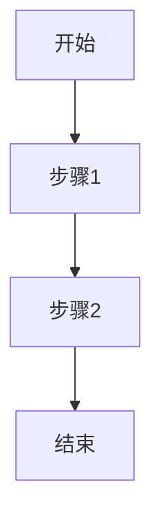

# Optimize Iteration Spec - 迭代文档优化

## 目标

检查并优化迭代制SaaS产品的需求文档，确保文档质量达到可交付标准。

## 四层结构评分

### 第一层：功能概述 (25分)

**检查项**:
- [ ] 目标和价值清晰 (10分)
- [ ] 用户场景明确 (10分)
- [ ] 边界界定清楚 (5分)

**评分标准**:
- **优秀 (20-25分)**: 描述完整，逻辑清晰，有具体例子
- **良好 (15-19分)**: 描述基本完整，逻辑基本清晰
- **需改进 (0-14分)**: 描述不完整或逻辑混乱

### 第二层：页面交互 (25分)

**检查项**:
- [ ] 状态覆盖完整 (10分)
- [ ] 布局描述清晰 (10分)
- [ ] 动效说明充分 (5分)

**评分标准**:
- **优秀 (20-25分)**: 所有状态都有说明，布局和动效详细
- **良好 (15-19分)**: 主要状态有说明，布局基本清晰
- **需改进 (0-14分)**: 状态遗漏或描述模糊

### 第三层：功能流程 (25分)

**检查项**:
- [ ] 主流程完整 (10分)
- [ ] 分支流程覆盖 (10分)
- [ ] 异常处理说明 (5分)

**评分标准**:
- **优秀 (20-25分)**: 流程完整，分支齐全，异常处理清楚
- **良好 (15-19分)**: 主流程完整，主要分支有说明
- **需改进 (0-14分)**: 流程不完整或分支遗漏

### 第四层：业务逻辑 (25分)

**检查项**:
- [ ] 业务规则明确 (10分)
- [ ] 数据关系清楚 (10分)
- [ ] 依赖关系说明 (5分)

**评分标准**:
- **优秀 (20-25分)**: 规则完整，数据清晰，依赖明确
- **良好 (15-19分)**: 主要规则明确，数据关系基本清楚
- **需改进 (0-14分)**: 规则遗漏或关系模糊

## 子能力

### __scoring: 文档评分

**功能**: 按四层结构给需求文档打分

**触发词**:
- "检查文档质量"
- "评估完整性"
- "给文档打分"
- "文档够详细吗"

**输出格式**:
```markdown
## 文档评分报告

### 总分: XX/100

### 第一层：功能概述 (XX/25)
- [ ] 目标和价值: X/10
- [ ] 用户场景: X/10
- [ ] 边界界定: X/5
**评价**: {评价}

### 第二层：页面交互 (XX/25)
- [ ] 状态覆盖: X/10
- [ ] 布局描述: X/10
- [ ] 动效说明: X/5
**评价**: {评价}

### 第三层：功能流程 (XX/25)
- [ ] 主流程: X/10
- [ ] 分支流程: X/10
- [ ] 异常处理: X/5
**评价**: {评价}

### 第四层：业务逻辑 (XX/25)
- [ ] 业务规则: X/10
- [ ] 数据关系: X/10
- [ ] 依赖关系: X/5
**评价**: {评价}

### 总体评价
{总体评价}

### 改进建议
1. {建议1}
2. {建议2}
```

### __completion: 需求补全

**功能**: 根据缺失项生成可直接粘贴的补全内容

**触发词**:
- "补全文档"
- "生成模板"
- "缺少XX怎么写"
- "帮我完善需求"

**输出格式**:
```markdown
## 需求补全

### 缺失项识别
- 第一层缺失: {项}
- 第二层缺失: {项}
- 第三层缺失: {项}
- 第四层缺失: {项}

### 补全内容
```markdown
{可直接粘贴的内容}
```

### 使用方法
复制上述内容，粘贴到文档对应位置
```

### __examples: 需求示例库

**功能**: 提供多领域功能说明示例

**触发词**:
- "需求怎么写"
- "有没有例子"
- "参考案例"
- "模板示例"

**示例分类**:
1. CRUD功能
2. 审批流程
3. 数据展示
4. 权限管理
5. 文件操作
6. 搜索功能
7. 通知推送

## 使用流程

### Step 1: 评分

```bash
# 输入：需求文档路径或内容
optimize-iteration-spec --score /path/to/doc.md

# 输出：评分报告
```

### Step 2: 补全

```bash
# 基于评分结果，生成补全内容
optimize-iteration-spec --complete /path/to/doc.md

# 输出：补全内容
```

### Step 3: 复查

```bash
# 补全后再次评分
optimize-iteration-spec --score /path/to/doc.md

# 验证：总分是否达标
```

## 模板

### 功能模板

```markdown
## {功能名称}

### 1. 功能概述

#### 1.1 目标和价值
- **目标**: {一句话描述}
- **用户价值**: {对用户的价值}
- **业务价值**: {对业务的价值}

#### 1.2 用户场景
- **场景1**: {具体场景描述}
- **场景2**: {具体场景描述}

#### 1.3 边界界定
- **包含**: {做什么}
- **不包含**: {不做什么}

### 2. 页面交互

#### 2.1 状态定义
| 状态 | 描述 | 触发条件 |
|------|------|---------|
| 初始 | {描述} | {条件} |
| 加载中 | {描述} | {条件} |
| 成功 | {描述} | {条件} |
| 失败 | {描述} | {条件} |

#### 2.2 布局描述
```
{布局描述或示意图}
```

#### 2.3 动效说明
- {动效1}: {描述}
- {动效2}: {描述}

### 3. 功能流程

#### 3.1 主流程


#### 3.2 分支流程
- **分支1**: {描述}
- **分支2**: {描述}

#### 3.3 异常处理
- **异常1**: {处理方式}
- **异常2**: {处理方式}

### 4. 业务逻辑

#### 4.1 业务规则
- BR-{编号}: {规则描述}

#### 4.2 数据关系
```
{数据关系图或描述}
```

#### 4.3 依赖关系
- 依赖: {依赖项}
- 被依赖: {被依赖项}
```

## 质量标准

### 交付标准 (总分≥80分)

- [ ] 功能概述 ≥20分
- [ ] 页面交互 ≥20分
- [ ] 功能流程 ≥20分
- [ ] 业务逻辑 ≥20分

### 优秀标准 (总分≥90分)

- [ ] 四层都 ≥22分
- [ ] 有具体例子
- [ ] 有流程图
- [ ] 有数据关系图

## 与其他技能的集成

### 前置技能
- `requirements-clarifier` - 需求澄清后使用本技能评分

### 后置技能
- `architecture-designer` - 评分达标后进入架构设计
- `tech-proposal` - 用于技术方案评估

### 协作技能
- `prd-generator` - 配合生成完整PRD
- `workflow-orchestrator` - 流程编排

---

**维护**: 根据迭代文档经验持续优化
**来源**: Cursor Hi Offer optimize-iteration-spec
**相关**: requirements-clarifier, prd-generator, architecture-designer
