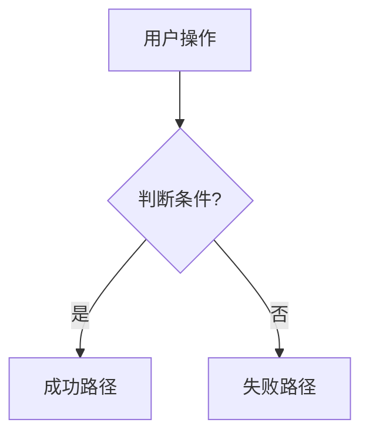

# PRD Generator - 产品需求文档生成器

## 适用范围

**触发条件**: 用户提出模糊的产品想法或功能需求
**输出物**: 结构化的产品需求文档（PRD）
**工作环境**: 配合 Obsidian 文档管理系统

---

## 核心原则

### 1. 从模糊到清晰
- 将用户的模糊想法转化为结构化需求
- 通过提问引导用户明确需求边界
- 避免主观臆断，所有假设必须确认

### 2. 业务语言优先
- 使用 PM 和业务人员能理解的语言
- 避免技术术语堆砌
- 关注业务价值和用户体验

### 3. 渐进式细化
- 先确定大框架，再填充细节
- 每个阶段都要获得 PM 确认
- 支持迭代优化

---

## PRD 标准结构

### 第一部分：产品概述

#### 1.1 产品定位
- **目标用户**: 谁会使用这个产品？
- **核心价值**: 解决什么问题？
- **差异化**: 与竞品的区别是什么？

#### 1.2 业务目标
- **短期目标** (3个月内)
- **中期目标** (6-12个月)
- **关键指标** (KPI)

#### 1.3 用户画像
| 用户类型 | 特征 | 痛点 | 期望 |
|---------|------|------|------|
| 主要用户 |      |      |      |
| 次要用户 |      |      |      |

---

### 第二部分：功能需求

#### 2.1 功能清单
| 功能模块 | 优先级 | 功能描述 | 验收标准 |
|---------|--------|---------|---------|
| 核心功能1 | P0 |  |  |
| 核心功能2 | P0 |  |  |
| 辅助功能1 | P1 |  |  |

#### 2.2 功能详细说明

**模板**:
```markdown
### {功能名称}

**功能概述**: 一句话描述功能

**用户场景**: 
- 场景1: 用户在什么情况下使用？
- 场景2: ...

**主要流程**:


**业务规则**:
- BR-{编号}: 规则描述

**边界条件**:
- 最小值/最大值限制
- 异常情况处理
- 依赖条件

**验收标准**:
- [ ] 功能点1
- [ ] 功能点2
```

---

### 第三部分：非功能需求

#### 3.1 性能要求
- **响应时间**: API 响应 < 2s
- **并发量**: 支持 1000+ 并发用户
- **可用性**: 99.9% uptime

#### 3.2 安全要求
- 数据加密
- 权限控制
- 隐私保护

#### 3.3 兼容性要求
- 支持的平台（iOS/Android/Web）
- 最低版本要求
- 浏览器兼容性

---

### 第四部分：商业模式（如适用）

#### 4.1 定价策略
| 套餐 | 价格 | 功能范围 | 目标用户 |
|-----|------|---------|---------|
| 免费版 | $0 |  |  |
| 基础版 | $X/月 |  |  |
| 专业版 | $Y/月 |  |  |

#### 4.2 收入模型
- 订阅收入
- 增值服务
- 其他收入来源

---

### 第五部分：实施计划

#### 5.1 里程碑
| 阶段 | 时间 | 交付物 | 验收标准 |
|-----|------|--------|---------|
| MVP | Week 1-4 |  |  |
| Beta | Week 5-8 |  |  |
| 正式版 | Week 9-12 |  |  |

#### 5.2 风险评估
| 风险 | 影响 | 概率 | 应对措施 |
|-----|------|------|---------|
|     | 高/中/低 | 高/中/低 |  |

---

### 第六部分：待确认项

| 序号 | 待确认内容 | 影响范围 | 优先级 | 结论 |
|-----|----------|---------|--------|-----|
| 1 |  |  | P0 |  |
| 2 |  |  | P1 |  |

---

## 执行流程

### Step 1: 需求收集

**提问清单**:
1. 这个产品/功能要解决什么问题？
2. 目标用户是谁？他们的特征是什么？
3. 用户在什么场景下会使用？
4. 期望的业务目标是什么？（用户量、收入、留存率等）
5. 有哪些竞品？我们的差异化在哪里？
6. 有哪些必须做的功能（P0）？哪些是可选的（P1/P2）？
7. 有时间和预算限制吗？
8. 有技术栈偏好吗？

**🛑 Checkpoint 1**: 确认需求收集完整

---

### Step 2: 生成 PRD 初稿

**输出内容**:
- 产品概述（1.1-1.3）
- 功能清单（2.1）
- 核心功能详细说明（2.2，仅 P0 功能）
- 待确认项清单

**交付方式**:
- 如果文档 < 500 行：一次性输出
- 如果文档 > 500 行：按照 Obsidian 渐进式优化规范拆分

**🛑 Checkpoint 2**: PM 确认 PRD 初稿

---

### Step 3: 细化与补充

**根据 PM 反馈**:
- 补充缺失的功能说明
- 细化业务规则
- 添加流程图（使用 Mermaid 标准语法）
- 完善验收标准

**🛑 Checkpoint 3**: PM 确认最终版本

---

### Step 4: 输出与归档

**输出位置**:
1. **项目文档**: `prd/v{版本号}-prd.md`
2. **Obsidian Vault**: `projects/{项目名}/prd/v{版本号}/`
3. **OpenSpec**: `.openspec/active/features/` (如需要)

**版本控制**:
```bash
git add prd/v{版本号}-prd.md
git commit -m "docs(prd): 完成 v{版本号} PRD 文档"
```

---

## VerveFlow 特定场景

### 场景1：新功能需求

**示例**: "我想加一个语音转文字的功能"

**引导提问**:
1. 语音来源是什么？（实时录音 / 上传文件）
2. 支持哪些语言？
3. 转写准确率要求是多少？
4. 转写速度要求？（实时 / 离线）
5. 转写结果如何展示？
6. 是否需要编辑功能？
7. 是否需要导出功能？
8. 计费方式？（按时长 / 按次数）

**生成 PRD 章节**:
- 2.X-语音转文字模块.md
- 包含流程图、业务规则、边界条件

---

### 场景2：优化现有功能

**示例**: "AI 笔记生成太慢了，需要优化"

**引导提问**:
1. 当前速度是多少？期望速度是多少？
2. 慢在哪个环节？（API 调用 / 数据处理 / 渲染）
3. 是否可以接受异步处理？
4. 是否需要进度提示？
5. 优化后的验收标准是什么？

**生成 PRD 章节**:
- 优化需求说明
- 性能指标对比
- 技术方案建议（可选）

---

## 质量检查清单

### 内容完整性
- [ ] 产品定位清晰
- [ ] 目标用户明确
- [ ] 核心功能已列出
- [ ] 业务规则已定义
- [ ] 验收标准可量化

### 可读性
- [ ] 使用业务语言，避免技术术语
- [ ] 流程图使用标准 Mermaid 语法
- [ ] 表格格式规范
- [ ] 章节层级清晰

### 可执行性
- [ ] 功能边界明确（做什么 / 不做什么）
- [ ] 优先级已标注（P0/P1/P2）
- [ ] 验收标准可测试
- [ ] 待确认项已列出

---

## 与 Obsidian 工作流集成

### 1. 使用 Obsidian 模板

在 Obsidian 中创建 PRD 模板：
```markdown
---
tags: [prd, v{{version}}, {{project}}]
created: {{date}}
status: draft
---

# {{项目名}} PRD v{{version}}

> **文档状态**: 草稿 / 评审中 / 已确认
> **创建时间**: {{date}}
> **最后更新**: {{date}}
> **负责人**: {{owner}}

## 快速导航
- [[#产品概述]]
- [[#功能需求]]
- [[#商业模式]]
- [[#实施计划]]

---

[按照标准结构填充内容]
```

### 2. 使用双链关联

**关联设计文档**:
```markdown
## 相关文档
- 设计稿: [[Figma-VerveFlow-v1.0]]
- API 文档: [[API-Spec-v1.0]]
- 数据库设计: [[DB-Schema-v1.0]]
```

### 3. 使用标签分类

**标签体系**:
- `#prd` - 产品需求文档
- `#v1.0` / `#v2.0` - 版本号
- `#verveflow` - 项目名
- `#draft` / `#confirmed` - 文档状态
- `#p0` / `#p1` / `#p2` - 优先级

---

## 最佳实践

### 1. 保持简洁
- 一个功能说明控制在 1-2 页
- 避免冗长的描述
- 使用表格和流程图代替大段文字

### 2. 关注业务价值
- 每个功能都要说明"为什么做"
- 量化业务目标（用户增长、收入提升）
- 避免"为了技术而技术"

### 3. 预留灵活性
- 不要过度设计
- 待确认项要明确标注
- 支持迭代优化

### 4. 与团队协作
- 定期同步 PRD 更新
- 使用 Git 版本控制
- 重要变更要通知相关人员

---

## 版本历史

| 版本 | 日期 | 变更内容 |
|-----|------|---------|
| v1.0 | 2026-01-26 | 基于 youtubex 经验，适配 VerveFlow 项目 |

---

**适用**: 所有需要编写 PRD 的场景
**维护**: 根据实际使用经验持续优化
**相关 Skill**: 
- `[[prd-mermaid-flowchart-standard]]`
- `[[obsidian-document-optimization]]`
- `[[requirement-clarifier]]`
